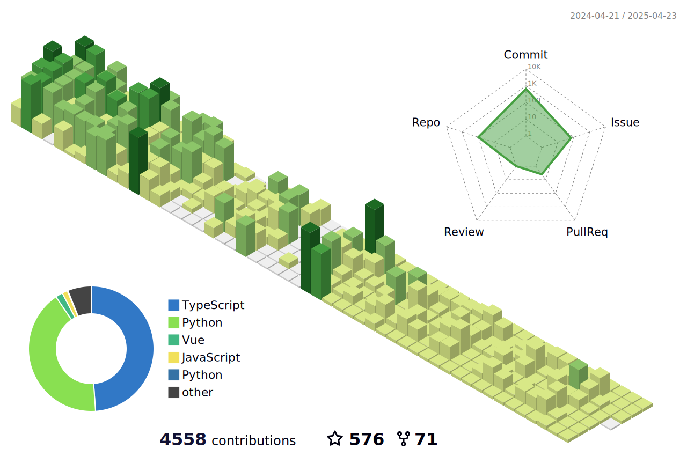
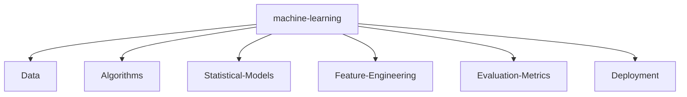

#  Hello, my name is Saito (Anders).

I am 🧙 Lead AI Full-Stack Software Engineer and 🏆 Open Source lover

Welcome to my page; on my Github, you can find:

- Projects created by me
- Projects contributed by me

## 📧 You can contact me on:

[](https://t.me/andersn0093)

_I am open to new opportunities/contributions._

## 🔎 You can find me on:

<a href="mailto:anderns0093@gmail.com"></a>
[](https://www.linkedin.com/in/saito-satoru/)
[](https://t.me/andersn0093)
[](https://saito-satoru.vercel.app/)

## 🔖 Featured repositories:

[](https://github.com/saito0093/CodeAntAI)
[](https://github.com/saito0093/mercurjs)
[](https://github.com/saito0093/aio-proxy)

---

## Personal stats:

#### With over 9 years of experience and 7+ years of education in Computer Science, an AI Full-Stack Software Engineer specializes in designing and developing both web frontends and backends. Skilled in JavaScript frameworks like React, Next.js, Vue, Svelte, and Angular, and proficient with back-end technologies such as Node.js, Django, and FastAPI, this role focuses on creating scalable, efficient, and secure applications.

<details>
  <summary>Highlights / Proficiencies / Interests / Believes</summary>

Highlights:

- ⭐ 9+ years of professional experience in full lifecycle development
- ⭐ 6+ years of senior AI Full-Stack software engineer
- ⭐ Delivered over 20 projects
- ⭐ Worked with over 5 companies from startup to enterprise level
- ⭐ Mentoring over 20 individuals on how to grow their technical and leadership skills
- ⭐ Worked on innovative and cutting-edge projects
- ⭐ Contribute to open source and private source
- ⭐ Master new technologies, master computer science and mathematics

Proficiencies:

- 📚 AI, ML, NLP, LLM, OpenAI, GenSparkAI, VectorDB
- 📚 JavaScript, TypeScript, Python, Django, FastAPI, Node.js with Serverless and Containers and Microservices architecture
- 📚 React.js + Next.js + SSR/CSR + Prisma + Vercel
- 📚 Vue.js + Nuxt.js + SSR/CSR + TypeOrm + Cloudflare
- 📚 Angular, RxJS, NgRx
- 📚 Svelte and Stencil + Storybook + Web Components
- 📚 SQL and NoSQL databases (MySQL, PostgreSQL, MongoDB, DynamoDB, Redis)
- 📚 AWS, Azure and GCP
- 📚 HTML5/CSS3 + Canvas + WebGL + Animation
- 📚 Agile, Scrum, Kanban
- 📚 Web and AI startups

Big believer in:

- 💡 Power of continuous learning and personal growth
- 💡 Importance of cultivating a positive mindset and embracing optimism
- 💡 Value of hard work and perseverance in achieving success
- 💡 Power of empathy and kindness in fostering meaningful connections and creating a harmonious society
- 💡 Importance of ethical behavior and integrity in all aspects of life

</details>

<!-- ## 🥇 Primary technology stack


## 🥈 Secondary technology stack


## 🥉 Tertiary technology stack


 -->

---

<!--   stats + languages -->

| .                                                                                                                                                 | .                                                                                                                              |
| ------------------------------------------------------------------------------------------------------------------------------------------------- | ------------------------------------------------------------------------------------------------------------------------------ |
|  |

<!--   profile-green-animate -->



</img>

<div align="center">
<summary>Trophy: Github Profile Trophy</summary>
</div>

<p align="center"> 
<a href="https://github.com/ryo-ma/github-profile-trophy"></a>
</p>

   <!--machine-learning-->



<!--  -->

---

<p align="center"><strong>Connect With Us</strong></p>

<a href="mailto:anderns0002@gmail.com"></a>
<!-- [](https://x.com/yuyasano0093) -->
[](https://www.linkedin.com/in/saito-satoru/)
[](https://t.me/andersn0093)
[](https://yuyasano.vercel.app/)

<!-- <p align="center">
<a href="mailto:selikhov.dmitrey@gmail.com"></a>
<a href="https://x.com/idimetrix">

</a>
<a href="https://www.linkedin.com/in/dimetrix">

</a>
<a href="https://t.me/dmitrii_selikhov">

</a>
<a href="https://elevanceit.com/">

</a>
</p> -->

```TypeScript
// Check if the code is functioning correctly

// Let's ensure the code is the epitome of excellence
if (isCodeWorking) {
    console.log("✨ Code works! Time to polish it until it shines.");
    // Perfection is our destination, so onward we go!
    while (codeQuality < perfection) {
        codeQuality++; // Increment the code quality score
        console.log(`Improving... Code quality now at ${codeQuality}.`);
    }
    console.log("🏆 Code has reached perfection!");
}

// The cycle of life: eat, sleep, repeat
while (alive) {
    eat();
    sleep();
    console.log("Repeat! Because life is a loop. 🍕💤🔁");
}

// - Yuya Sano
```

<!-- | Repository Activity Trends                                                                                                        | Collaborative Productivity - Last 28 days                                                                                                                 |
| --------------------------------------------------------------------------------------------------------------------------------- | --------------------------------------------------------------------------------------------------------------------------------------------------------- |
|  |  |

| Repository Performance Stats - Last 28 days                                                                                          | Active Contributors - Last 28 days                                                                                                                    |
| ------------------------------------------------------------------------------------------------------------------------------------ | ----------------------------------------------------------------------------------------------------------------------------------------------------- |
|  |  |

| Star Geographic Distribution                                                                                                                    | Star History                                                                                                                         |
| ----------------------------------------------------------------------------------------------------------------------------------------------- | ------------------------------------------------------------------------------------------------------------------------------------ |
|  |  |

| Company Affiliation                                                                                                                           | Lines of Code Changes                                                                                                                |
| --------------------------------------------------------------------------------------------------------------------------------------------- | ------------------------------------------------------------------------------------------------------------------------------------ |
|  |  |

| Pull Request Size                                                                                                                                   | Pull Request Lifecycle                                                                                                                             |
| --------------------------------------------------------------------------------------------------------------------------------------------------- | -------------------------------------------------------------------------------------------------------------------------------------------------- |
|  |  |

| Currently Working On - Last 28 days                                                                                                                     | Top Active Contributors - Last 28 Days                                                                                                    |
| ------------------------------------------------------------------------------------------------------------------------------------------------------- | ----------------------------------------------------------------------------------------------------------------------------------------- |
|  |  |

| Repository Annual Ranking                                                                                                                          |
| -------------------------------------------------------------------------------------------------------------------------------------------------- |
|  | -->
